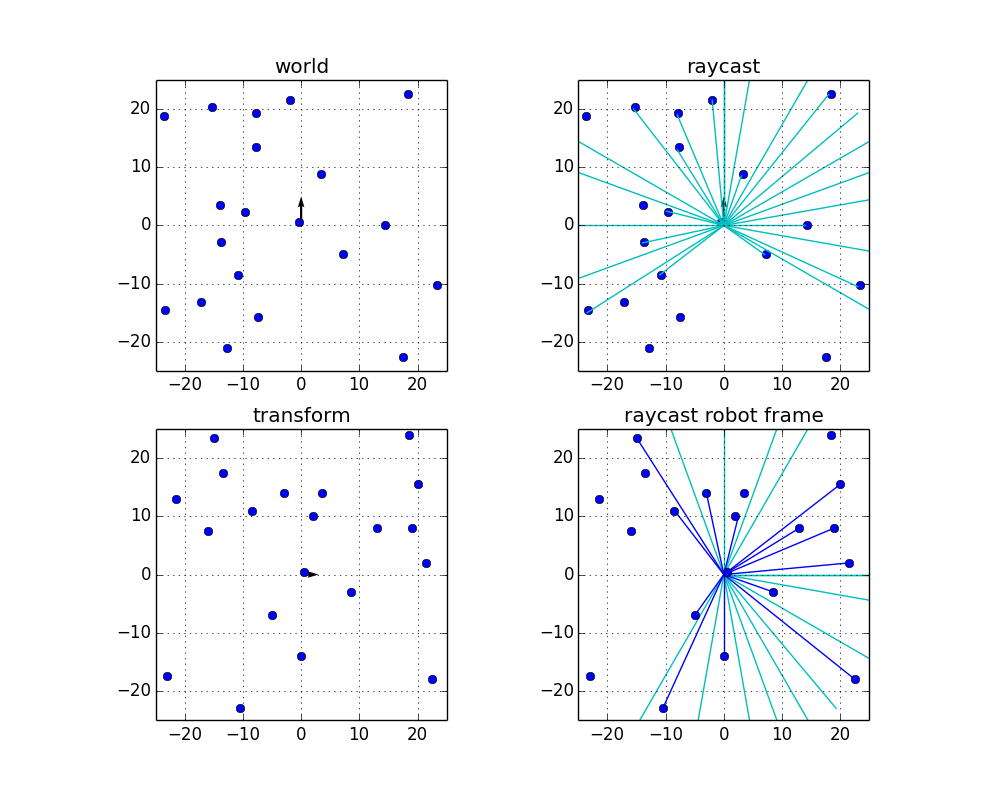

# raycasting
Acquire pseudo laser data for autonomous robot simulator.

## Requirement
- python2.7
- matplotlib
- numpy

## Parameter

### set resulution

```python:dumy_lidar.py
xyreso = 0.50 # x-y grid resolution 
yawreso = math.radians(10) # yaw angle resolution [rad]
```

### set lidar param

```python:dumy_lidar.py
min_range = 0.30 # [m]
max_range = 30.0 # [m]
angle_limit = math.radians(270) # [rad]
```

### set grid_map size

```python:dumy_lidar.py
grid_size = 100
grid_map = np.zeros((grid_size, grid_size))
```

### set robot pose

```python:dumy_lidar.py
pose = np.array([0.0, 0.0, math.radians(90)]) # x, y, yaw
```

### add obstacle

```python:dumy_lidar.py
ox = (np.random.rand(20) - 0.5) * grid_size * xyreso #[m]
oy = (np.random.rand(20) - 0.5) * grid_size * xyreso #[m]
```

## How to Run
$ python dumy_lidar.py

## Reference
[Python Robotics](https://github.com/AtsushiSakai/PythonRobotics/tree/master/Mapping/raycasting_grid_map)


